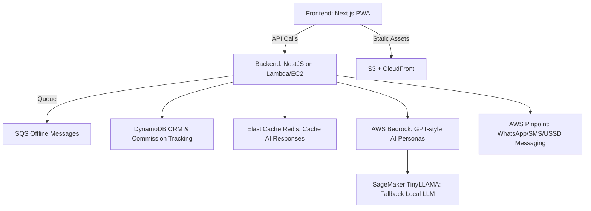

# Architecture Diagram

Here is the architecture diagram for the AutoRep AI application.

```mermaid
graph TD
  A[Frontend: Next.js PWA] -->|API Calls| B[Backend: NestJS on Lambda/EC2]
  B -->|Queue| C[SQS Offline Messages]
  B --> D[DynamoDB CRM & Commission Tracking]
  B --> E[ElastiCache Redis: Cache AI Responses]
  B --> F[AWS Bedrock: GPT-style AI Personas]
  F --> G[SageMaker TinyLLAMA: Fallback Local LLM]
  B --> H[AWS Pinpoint: WhatsApp/SMS/USSD Messaging]
  A -->|Static Assets| I[S3 + CloudFront]
```
